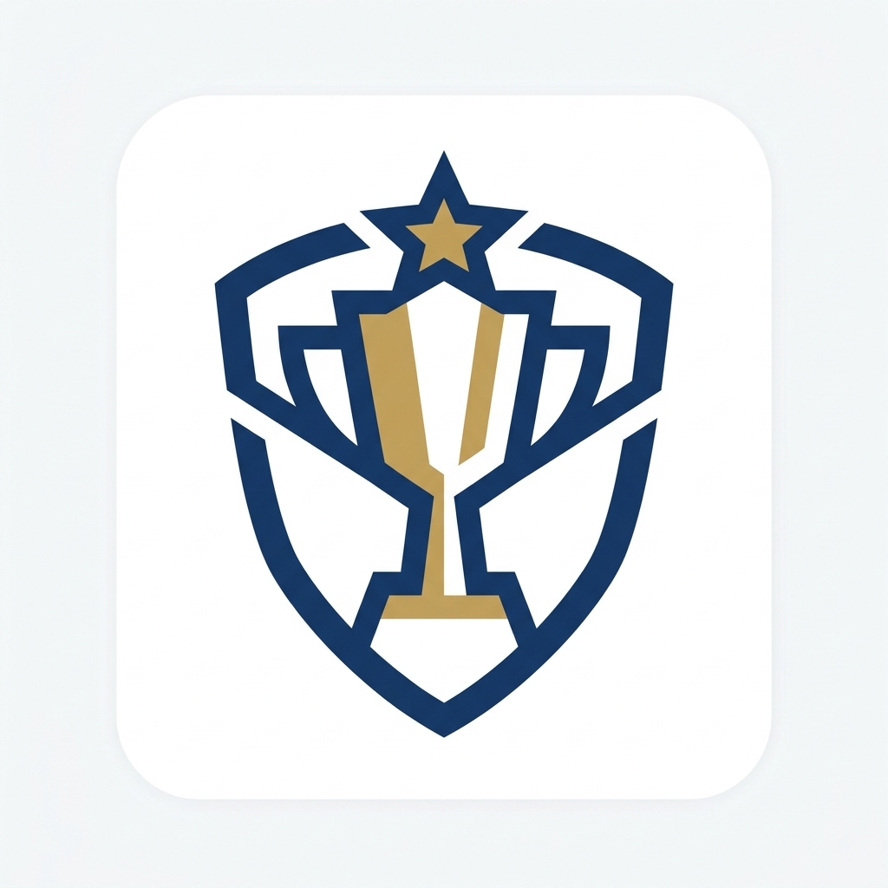

<h1 align="center"> Gestión de Ligas y Competiciones </h1>

<p align="center">
  
</p>

<p align="center">
  
  
  
</p>

## Índice
* [Descripción del proyecto](#descripción-del-proyecto)
* [Estado del proyecto](#estado-del-proyecto)
* [Características de la aplicación](#características-de-la-aplicación)
* [Acceso y ejecución del proyecto](#acceso-y-ejecución-del-proyecto)
* [Tecnologías utilizadas](#tecnologías-utilizadas)
* [Autores](#autores)

## 📝 Descripción del proyecto
**Gestión de Ligas y Competiciones** es una solución Cliente-Servidor diseñada para facilitar la administración integral de torneos amateur, ligas deportivas y eventos entre amigos. 

Surgió ante la necesidad de abandonar las clásicas hojas de Excel para llevar el recuento de puntos, ofreciendo en su lugar una aplicación móvil intuitiva respaldada por un servidor remoto robusto y seguro.

## 🚧 Estado del proyecto
<h4 align="left">
🚧 Proyecto en desarrollo (Fase de entrega final intermodular) 🚧
</h4>

## ✨ Características de la aplicación
- `Gestión de Ligas`: Creación de ligas personalizadas con fechas límite y puntos iniciales.
- `Sistema de Invitaciones`: Invita a tus amigos a unirse a tu liga directamente buscando su usuario.
- `Roles y Privilegios`: El creador de la liga puede otorgar permisos de "Administrador" a otros participantes.
- `Eventos y Retos`: Creación de partidos o apuestas internas donde el ganador se lleva el bote de puntos.
- `Reparto Atómico de Puntos`: El servidor calcula y distribuye los puntos de forma segura tras finalizar un evento.
- `Perfiles de Usuario`: Avatares integrados y edición de la información de tu cuenta.

## 🚀 Acceso y ejecución del proyecto
El proyecto está dividido en dos partes principales: el servidor (Backend) y la aplicación móvil (Frontend). Para probarlo de forma local, sigue estos pasos:

### 1. Ejecutar el Servidor (Django)
1. Navega a la carpeta `Backend`.
2. Crea un entorno virtual e instala las dependencias:
   ```bash
   python -m venv venv
   source venv/Scripts/activate  # En Windows
   pip install django
   ```
3. Realiza las migraciones para generar la base de datos vacía:
   ```bash
   python manage.py migrate
   ```
4. Levanta el servidor local:
   ```bash
   python manage.py runserver
   ```

### 2. Ejecutar la App Móvil (Android)
1. Abre la carpeta `Frontend` usando **Android Studio**.
2. Espera a que termine la sincronización de Gradle.
3. Asegúrate de que la IP apuntada en `ApiClient.java` corresponde a tu entorno (por defecto `10.0.2.2` si usas el emulador de Android).
4. Compila y ejecuta el proyecto pulsando "Run" o "Play".
5. ¡Importante! Al ser un entorno local nuevo, deberás usar el botón de **Registro** en la app para crear tu primer usuario.

## 🛠️ Tecnologías utilizadas
- **Frontend:**
  - Android SDK (Nivel 24+)
  - Java
  - UI XML
- **Backend:**
  - Python 3.10+
  - Django 4.x
  - SQLite3 (Base de datos)
- **Comunicación:**
  - Arquitectura REST API (JSON)

## 👨‍💻 Autores
| [<br><sub>Eduardo Pérez López</sub>](https://github.com/eduplopez) |
| :---: |

> Este proyecto ha sido desarrollado como trabajo final intermodular del Ciclo Formativo de Grado Superior en Desarrollo de Aplicaciones Multiplataforma (DAM).